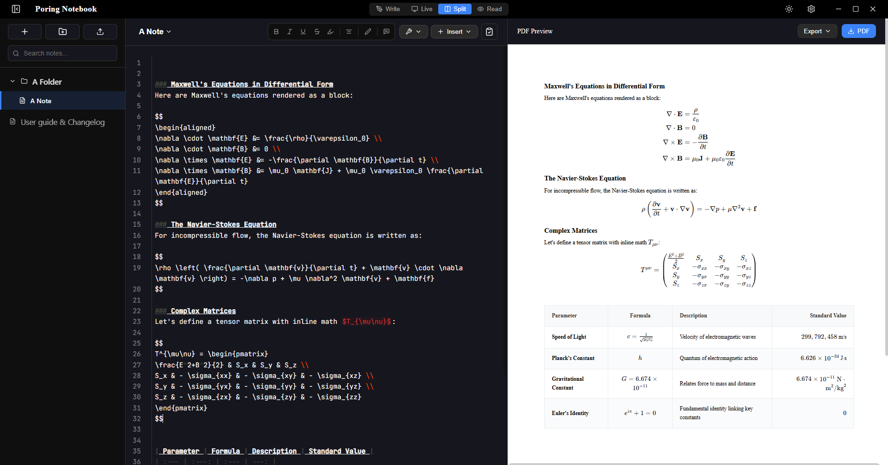

# Poring Notebook

A local-first desktop notebook built for AI-assisted studying. Write or paste plain Markdown, render equations with KaTeX, preview your document as you work, and export to PDF, .docx, or Google Docs with a click.

[&style=for-the-badge&color=2563eb)](https://github.com/ShahMdAbid/pnb-exe/releases/latest)
[&style=for-the-badge&color=10b981)](https://github.com/ShahMdAbid/pnb-exe/releases/latest)

---

##  User Guide & Feature Walkthrough

### 1. Download & Installation

**For Windows:**
1. Click the **[Download for Windows (.exe)](https://github.com/ShahMdAbid/pnb-exe/releases/latest)** button above.
2. Run the downloaded installer file (e.g., `Poring-Notebook-Setup-xxx.exe`).

**For Linux:**
1. Click the **[Download for Linux (.AppImage)](https://github.com/ShahMdAbid/pnb-exe/releases/latest)** button above.
2. You can download either the `.AppImage` (portable) or `.deb` (installer) file.
3. For `.AppImage`, open terminal, grant execute permission (`chmod +x filename.AppImage`), and run it.

**Dependencies (Both OS):**
4. To export notes containing math equations properly into `.docx` or Google Docs format, you **must install Pandoc**.
  - Go to the [Pandoc Releases Page](https://github.com/jgm/pandoc/releases/latest).
  - Download and install the appropriate installer for your OS (`.msi` for Windows, `.deb` or `tar.gz` for Linux).
4. Open **Poring Notebook** from your Desktop or Start Menu.
5. Try exporting a note to `.docx`. If it exports successfully, you're all set! If it fails, open **Settings** (⚙️) ➔ **General** and paste your custom Pandoc path into the **Custom Pandoc Path** field


<p align="center">
  
</p>


### 2. Workspace Setup (Optional)
By default, Poring Notebook creates a local notes directory. 
- Click the **Gear Icon** ⚙️ (upper right) to open **Preferences**.
- Change your **Workspace Folder** to any custom directory on your hard drive. All your `.md` files and images will be stored locally .

> **💡 Note on Updates:** You only need to download the installer once! Whenever a new version is available, just click "Check Update" button in Settings.

---

### 3. Sidebar & Note Organization
- **Open Sidebar**: Click the **Book Icon**  next to the *"Poring Notebook"* header in the top titlebar to expand or collapse the left sidebar.
- **Create Note & Folder**: Click **`+ Note`** or **`+ Folder`** to organize your documents.
- **Drag & Drop**: Easily drag any note and drop it inside a folder to reorganize your structure.

---

### 4. Writing Notes & External AI Workflow
- **Manual Writing**: Write your notes using standard Markdown and KaTeX math syntax:
  - Inline Math: `$E = mc^2$`
  - Block Math: `$$ \int_{a}^{b} f(x) \, dx = F(b) - F(a) $$`
  - **Mermaid Diagrams**: Create flowcharts and diagrams using Mermaid syntax blocks. 

**In-App AI Features are Deprecated**
   In-app AI API setups often create friction for new users and clutter the interface. So built-in AI tools are removed to keep Poring Notebook **minimal, focused**.

> 💡 You can still use AI seamlessly!  
> Because Poring Notebook saves all your notes as standard `.md` files in your native local OS workspace, you can open your workspace folder in **Antigravity, Codex or Claude code**. Any changes made by external AI tools will update **live in real time** inside Poring Notebook! 

- **External AI Workflow**:
  1. Click on the note title button in the top toolbar and select **Copy Path**.
  2. Open the file path in **Antigravity** or your preferred IDE/AI assistant.
  3. Prompt the AI to reformat, edit, or generate content.
  4. Watch Poring Notebook update **instantly in real time**!

---

### 5. Images, Drawing Canvas & Cover Pages
- **Paste / Insert Images**: Paste images directly from your clipboard or use the toolbar insert button. Images are saved locally using native protocols:
  ```markdown
  
  ```
  *(Default image widths can be customized inside Settings).*
- **Interactive Drawing Canvas**: Click **`+ Insert`** -> **`Drawing`** to open the built-in sketchpad. Sketch figures, equations, or diagrams and save them straight into your note.
- **Edit Drawings Anytime**: Double-click on any embedded drawing or image in Live/Preview mode to re-open the canvas and edit it!
- **Preset Cover Pages**: Insert a preset Cover Page template from the toolbar to give your academic documents a professional cover.

---

### 6. Workspace View Modes
Switch between four view modes using the top-right mode toggles:
-  **Write**: Minimalist, editor-only environment for typing.
- **Live**: Instant rendered document preview as you type.
- **Split**: Side-by-side Markdown editor and rendered preview.
- **Read**: Distraction-free full-screen reading mode.

> **💡 Note:** In split mode double-click on any line on the PDF preview to jump to the corresponding text box in the text editor.

---

### 7. PDF preview pane
- Typing `***` inserts a visual red page-break line into your document.
- When exporting to PDF, this line specifies exact page divisions. 
- **Alignment note**: Tables or images sitting directly on a page break line will automatically be pushed down to the next page, preventing awkward document cuts! However, please double-check if any, cause subsequent note will shift position downward in actual pdf.

---

### 8.  Automated Clipboard Listener
When researching or batch-copying information from websites and documents:
- Click the **Clipboard Icon** 📋 in the top toolbar to enable **Auto-Note (Clipboard Listener)**.
- Every piece of text you copy to your clipboard will automatically be saved into a new timestamped note, saving you from tedious manual copy-pasting!


---

### 9. Exporting & Sharing
Click the **`Export`** dropdown menu in the top-right toolbar:
- **PDF Export**: Generate professional PDFs with clean page divisions and rendered KaTeX formulas.
- **Microsoft Word (`.docx`)**: Export markdown and math directly into native Word equations via Pandoc.
- **Google Docs**: Direct export pipeline for Google Workspace. *(Note: Google may show a security warning during login. Click continue and give permission).*
- **Share Archive (`.zip`)**: Export your notes and embedded images as a single `.zip`. Friends can import it directly from their left sidebar!

---

### 10. Keyboard Shortcuts
If you are using a laptop with a smaller screen and the toolbar or editor feels cramped, you can easily adjust the UI scale:
- Press **`Ctrl` + `+`**  to **Zoom In** (Make UI larger).
- Press **`Ctrl` + `-`**  to **Zoom Out** (Make UI smaller).
- Press **`Ctrl` + `0`** to **Reset** the zoom to default.

- **`Ctrl` + `F` (or `Cmd` + `F`)**: selects the entire text block or paragraph where your cursor is currently positioned. This makes it easy to grab or replace specific chunks of text without manually dragging your mouse.


